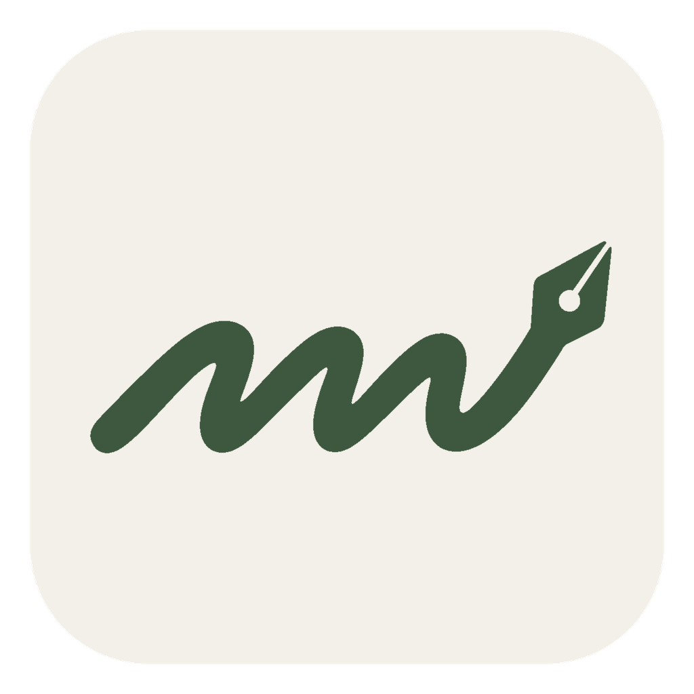
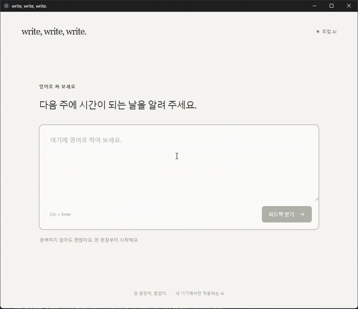

<div align="center">



# write, write, write.

### 한 문장씩, 멈추지 않고 쓰는 로컬 AI 영어 작문 연습

한국어 문장을 영어로 써 보고, 짧은 한국어 피드백을 받은 뒤 바로 다음 문장으로 넘어가세요.  
로그인도, 점수판도, API 키도 없습니다.


<br>



</div>

## 쓰는 흐름만 남겼습니다

**한국어 한 문장 → 영어로 작성 → 짧은 한국어 코칭 → 다음 문장**

영어 작문은 많이 써 볼수록 느는데, 학습 서비스의 레벨·점수·과정 선택이 오히려 흐름을 끊을 때가 있습니다. `write, write, write.`는 한 번에 한 문장만 보여 주고, 작성과 피드백을 계속 반복하는 데 집중합니다.

- **로컬 AI 피드백** — Qwen3 4B가 기기 안에서 답안을 검토합니다.
- **프라이버시 우선** — 모델 준비 후에는 답안을 외부 API로 보내지 않습니다.
- **바로 다음 문장** — 피드백을 읽고 `Enter`만 누르면 연습이 이어집니다.
- **120개의 일상 문장** — 전부 연습하면 다시 섞어 끝없이 반복합니다.
- **데스크톱과 웹** — Windows 앱으로 쓰거나 같은 Wi-Fi의 휴대폰에서 접속할 수 있습니다.
- **계정 없는 경험** — 로그인, 구독, 점수판, 기기 간 동기화가 없습니다.

## 빠르게 시작하기

개발 환경에는 **Node.js 22.12 이상**이 필요합니다.

```sh
git clone git@github.com:seobaeksol/write-write-write.git
cd write-write-write
npm install
npm start
```

첫 실행 시 Qwen3 4B Instruct 2507 Q4_K_M 모델을 약 **2.50GB** 다운로드하고 SHA-256 체크섬을 확인합니다. 준비된 모델은 다시 다운로드하지 않습니다. 이후 추론에는 외부 API 키, Ollama, 별도 LLM 서버가 필요하지 않습니다.

문장을 입력한 뒤 **피드백 받기** 또는 `Ctrl+Enter`(macOS: `⌘+Enter`)를 누르세요. 피드백 화면에서 `Enter`를 누르면 다음 문제로, **다시 써 보기**를 누르면 같은 문제로 돌아갑니다.

## 브라우저와 휴대폰에서 쓰기

같은 컴퓨터의 브라우저에서 사용할 때:

```sh
npm run web
```

[http://127.0.0.1:3210](http://127.0.0.1:3210)을 열면 됩니다.

같은 Wi-Fi에 연결된 휴대폰에서 사용할 때:

```sh
npm run web -- --lan
```

터미널에 표시된 **같은 Wi-Fi** 주소를 휴대폰에서 여세요. 모델은 컴퓨터에서 실행되므로 컴퓨터와 프로그램이 켜져 있어야 합니다. 연결되지 않으면 Windows 방화벽의 사설 네트워크에서 기본 포트 `3210`을 허용했는지 확인하세요.

> 현재 iOS·Android 기기에서 독립적으로 추론하는 네이티브 앱은 제공하지 않습니다.

## 데스크톱 앱 만들기

모델이 준비된 상태에서 Windows 실행 폴더를 만들려면:

```sh
npm run setup
npm run pack
```

`release/win-unpacked`의 `Write Write Write.exe`를 실행하세요. 다른 컴퓨터로 옮길 때는 `resources/models`를 포함한 폴더 전체가 필요합니다.

배포용 ZIP을 만들려면:

```sh
npm run build
```

모델과 Electron 런타임을 함께 담기 때문에 결과 파일이 큽니다. `pack`과 `build`는 네트워크 요청 없이 기본 모델을 검증하며, 모델이 준비되지 않았다면 중단합니다. macOS의 DMG와 Linux의 AppImage 설정도 포함되어 있지만 각 운영체제에서 직접 빌드해야 하며 아직 검증되지 않았습니다.

## 어떻게 동작하나요?

| 영역 | 구성 |
| --- | --- |
| 화면 | 빌드 도구 없는 HTML, CSS, JavaScript |
| 데스크톱 | Electron |
| 로컬 추론 | `node-llama-cpp` + Qwen3 GGUF |
| 문제 구성 | 미리 작성한 일상 한국어·영어 문장 120쌍 |
| 브라우저 저장 | 현재 문제, 초안, 피드백을 `localStorage`에 저장 |
| 서버 저장 | 최근 문제 256개만 로컬 파일에 보관 |

한 문장을 처리할 때마다 대화 문맥을 초기화해 이전 답안이 다음 피드백에 섞이지 않도록 합니다. 웹 모드의 문제 기록은 `.data/prompts.json`, 데스크톱 앱의 기록은 운영체제 앱 데이터 폴더 아래 `practice/prompts.json`에 저장됩니다. 답안 전체 기록이나 기기 간 동기화는 제공하지 않습니다.

## LM Studio 모델 선택하기

앱 오른쪽 위의 **모델 설정**에서 **LM Studio**를 선택하세요.

1. LM Studio의 **Developer**에서 로컬 서버를 켭니다. 기본 주소는 `http://127.0.0.1:1234`입니다.
2. 앱 설정에서 서버 주소를 확인하고 **목록 새로고침**을 누릅니다.
3. 다운로드한 대화 모델을 고르고 **이 모델 사용하기**를 누릅니다.

LM Studio가 GGUF와 MLX 모델을 실행하므로 파일을 복사하거나 다시 다운로드할 필요가 없습니다. 임베딩 모델은 목록에서 제외합니다. 모델 목록은 LM Studio의 `/api/v1/models`, 피드백은 `/v1/chat/completions`를 사용합니다. [LM Studio 구조화 출력 문서](https://lmstudio.ai/docs/developer/openai-compat/structured-output)를 따르며, JSON 출력과 한국어 코칭 품질은 선택한 모델에 따라 달라집니다.

LM Studio의 자동 로딩(JIT)을 켜거나 선택한 모델을 미리 불러와 주세요. 첫 피드백은 모델 로딩 때문에 오래 걸릴 수 있습니다. 서버는 같은 컴퓨터의 HTTP 주소만 지원하며, 인증이 필요한 서버는 현재 지원하지 않습니다. LM Studio가 꺼져 있으면 설정에서 **기본 모델**로 돌아갈 수 있습니다.

선택한 모델은 앱 데이터 폴더의 `practice/settings.json`에 저장됩니다. 웹 모드는 `.data/settings.json`을 사용합니다. 문장과 작성 중인 답안은 모델을 바꿔도 유지되고, 피드백 생성 중에는 모델 변경을 막습니다. 휴대폰에서 접속 중이라면 모델 변경은 서버가 실행 중인 컴퓨터에서 해 주세요. 개발 환경의 `npm start`는 기존과 같이 기본 모델도 준비합니다.

## 다른 모델 사용하기

다른 호환 가능한 **Qwen 계열 GGUF**를 시험하려면 실행 전 `WRITE_MODEL_PATH`에 파일의 절대 경로를 지정하세요.

```powershell
$env:WRITE_MODEL_PATH = "C:\\models\\your-qwen-model.gguf"
npm start
```

현재 프롬프트와 채팅 형식은 Qwen에 맞춰져 있습니다. 이 설정은 개발 실행에 사용할 모델만 바꾸며, 배포 빌드는 여전히 기본 모델을 검증합니다. 기본 모델의 고정 버전·체크섬·출처는 [models/README.md](models/README.md), 모델 라이선스는 [models/LICENSE-Qwen.txt](models/LICENSE-Qwen.txt)에서 확인할 수 있습니다.

## 피드백 방식

피드백은 실제 작성한 표현을 짚어 주는 한국어 2~3문장을 목표로 합니다. 한 번에 한 가지 학습 포인트를 설명하고, 올바른 답안은 원문 그대로 유지합니다. 선택적인 다른 표현은 **다른 표현도 배워 보기 · 선택 사항**으로 분리합니다. 형식에 맞지 않거나 수정 판정과 수정문이 모순되면 한 번 재시도합니다. 내용의 정확성과 말투는 선택한 모델에 따라 달라질 수 있습니다.

## 테스트

```sh
npm test
```

LM Studio가 실행 중이라면 실제 피드백 6개 사례도 확인할 수 있습니다. 출력의 `passed`는 예상 판정과의 일치 여부이며 설명의 정확성·말투는 사람이 확인해야 합니다.

```sh
node scripts/evaluate-tutor.mjs google/gemma-4-e4b
```

핵심 요청, 입력 검증, 연습 흐름을 확인합니다. 실제 피드백 품질과 운영체제별 패키지 실행은 별도로 확인해야 합니다.

## 앞으로 작업할 사항

- 영어 → 한국어 기능
- 문장 다양화 기능 (전문 분야, 수준, 글 길이 등)

## 현재 범위

이 프로젝트는 작고 집중된 프로토타입입니다. 작은 로컬 모델은 자연스러운 정답을 잘못 고치거나 설명에 오류를 낼 수 있습니다. 중요한 글의 최종 교정 도구보다는 **부담 없이 영어 문장을 많이 써 보는 연습 도구**로 사용해 주세요.

문제 제안이나 버그 리포트는 GitHub Issues로 남겨 주세요.
